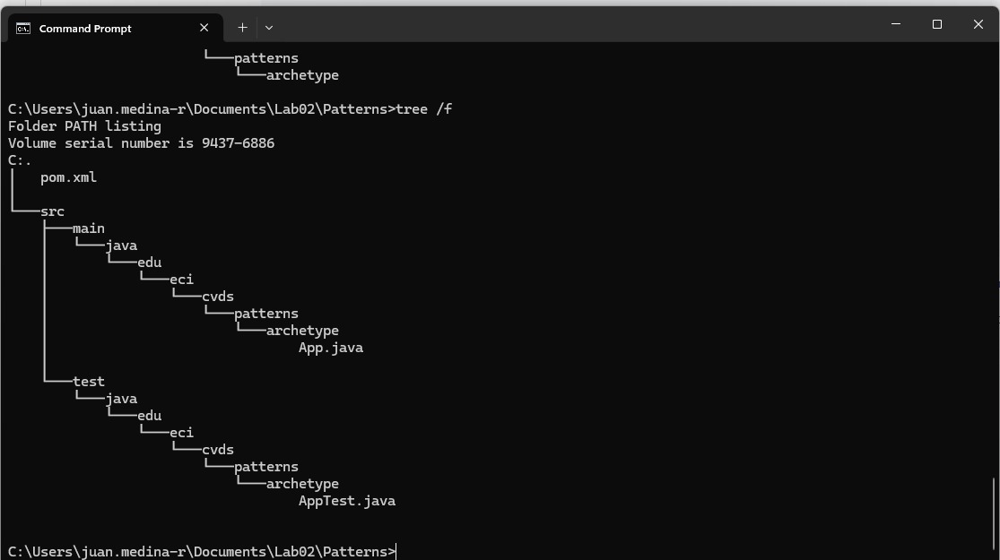
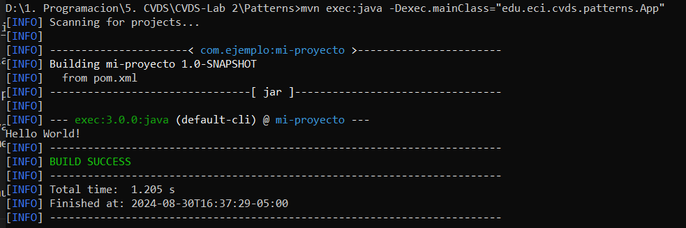

# CVDS-Lab2

## Integrantes
- Juan Sebastian Buitrago Piñeros - owner
- Juan Esteban Medina Rivas - collaborator

## Laboratorio 2 - Patterns

### Introducción a Maven

**Maven** es una herramienta de gestión y comprensión de proyectos. Su principal objetivo es proporcionar una visión completa del estado del proyecto en el menor tiempo posible. Para lograrlo, Maven se enfoca en varias áreas clave:

- **Facilitar el proceso de compilación.**
- **Proporcionar un sistema de compilación uniforme.**
- **Ofrecer información de calidad sobre el proyecto.**
- **Fomentar mejores prácticas de desarrollo.**

### Fases del Ciclo de Vida de Maven

Maven organiza el proceso de construcción del proyecto en **fases**, cada una representando una etapa en el ciclo de vida. Las principales fases son:

1. **`validate`**: Verifica que toda la información y dependencias necesarias estén disponibles.
2. **`compile`**: Compila el código fuente del proyecto.
3. **`test-compile`**: Compila los casos de prueba.
4. **`test`**: Ejecuta las pruebas.
5. **`package`**: Empaqueta el proyecto en un formato distribuible.
6. **`verify`**: Verifica la calidad del proyecto.
7. **`install`**: Instala el paquete en el repositorio local.
8. **`deploy`**: Implementa el paquete en el repositorio remoto.

### Ciclo de Vida de la Construcción

El **ciclo de vida de la construcción** en Maven describe el proceso completo desde la validación inicial hasta la implementación del paquete final. Cada fase se ejecuta en un orden específico para asegurar que todas las etapas del proceso de construcción se completen de manera eficiente y efectiva.

### Plugins en Maven

Los **plugins** en Maven son herramientas que realizan tareas específicas durante el ciclo de vida de la construcción, los cuales permiten realizar tareas como la compilación del código, la ejecución de pruebas, la creación de documentación, y más.

### Repositorio Central de Maven

El **repositorio central de Maven** es un repositorio remoto que contiene una amplia colección de bibliotecas y herramientas que los proyectos pueden utilizar. Es el centro para que los desarrolladores encuentren y compartan dependencias, facilitando la integración y el uso de bibliotecas en diferentes proyectos.


# Ejercicio de las figuras

## CREAR UN PROYECTO CON MAVEN

Creando un proyecto maven con ayuda de los arquetipos (archetypes).


Comprobando que se haya creado correctamente el conjunto de directorios con un conjunto de archivos básicos.

`$ cd Patterns` \
`$ tree`




## AJUSTAR ALGUNAS CONFIGURACIONES EN EL PROYECTO

En primer lugar, se tiene que cambiar la versión del compilador de Java a la version 8, para ello toca agreguegar la sección properties antes de la sección de dependencias:

```
<properties>
  <maven.compiler.target>1.8</maven.compiler.target>
  <maven.compiler.source>1.8</maven.compiler.source>
</properties>
```


## COMPILAR Y EJECUTAR

Para compilar usar el comando

```
mvn package
```


Si maven no actualiza las dependencias utilice la opción -U así:

```
 `$ mvn -U package`
```
### Objetivo del parametro package
El parámetro package en el comando mvn package le dice a Maven que ejecute todas las fases necesarias para construir y empaquetar el proyecto. Incluyendo:

1. Compile: Compila el código fuente del proyecto.
2. Test: Ejecuta las pruebas unitarias definidas en el proyecto.
3. Package: Empaqueta el código compilado en un formato distribuible, como un archivo JAR, WAR, etc., y lo coloca en el directorio target dentro del proyecto.
Por lo tanto, el objetivo principal del parámetro package es generar un artefacto (JAR, WAR, etc.) que pueda ser distribuido o desplegado.

Tambien existen varias otras fases quese pueden pasar como parámetros a mvn, cada una de las cuales tiene un propósito específico. Las más simples son:

A) Borra el directorio target, eliminando todos los archivos generados en compilaciones anteriores.
```
mvn clean
```
B) Verifica que el proyecto esté correcto y que toda la información necesaria esté disponible.
```
mvn validate
```
C) Compila el código fuente del proyecto.
```
mvn compile
```
D) Ejecuta las pruebas unitarias usando un marco de pruebas como JUnit.
```
mvn test
```

### Ejecutar un proyecto Maven
* Ahora, para ejecutar un proyecto Maven desde la línea de comandos usando una clase principal específica (mainClass), se puede usar:
```
mvn exec:java -Dexec.mainClass="edu.eci.cvds.patterns.App"
```
Lo que permite ejecutar programas Java directamente dentro del ciclo de vida de Maven.


* Realice el cambio en la clase App.java para crear un saludo personalizado, basado en los parámetros de entrada a la aplicación y despues utilizar la primera posición del parámetro que llega al método "main" para realizar el saludo personalizado, en caso que no sea posible, se debe mantener el saludo como se encuentra actualmente:


* ¿Cómo enviar parámetros al plugin "exec".?

Para mandar parametros al plugin "exec" se da de la siguiente manera
```
mvn exec:java -Dexec.mainClass="edu.eci.cvds.patterns.App" -Dexec.args="'argument1' 'argument2'"
```

* Ejecutar nuevamente la clase desde línea de comandos y verificar la salida: Hello World!



* Ejecutar la clase desde línea de comandos enviando su nombre como parámetro y verificar la salida. Ej: Hello Pepito!
```
mvn exec:java -Dexec.mainClass="edu.eci.cvds.patterns.App" -Dexec.args="Juan"
```


* Ejecutar la clase con su nombre y apellido como parámetro. ¿Qué sucedió?
```
mvn exec:java -Dexec.mainClass="edu.eci.cvds.patterns.App" -Dexec.args="Juan Buitrago"
```


* Verifique cómo enviar los parámetros de forma "compuesta" para que el saludo se realice con nombre y apellido.
```
mvn exec:java -Dexec.mainClass="edu.eci.cvds.patterns.App" -Dexec.args=""Juan", "Buitrago""
```


* Ejecutar nuevamente y verificar la salida en consola. Ej: Hello Pepito Perez!

## HACER EL ESQUELETO DE LA APLICACIÓN


* ¿Cuál fábrica hiciste? y ¿Cuál es mejor?

Se hizo Simple Factory en ShapeFactory , este tiene un método estático que decide qué instancia de clase se debe devolver, basado en el tipo de forma que se pasa como argumento.


Se seleccionó Simple Factory, debido a que:
* Factory Method es un poco más sofisticado y suele implicar que la clase base tenga un método que se sobreescriba en las subclases para crear objetos, pero nosotros no estamos usando subclases para diferenciar la creación de objetos.

* Abstract Factory es más avanzado y se utiliza cuando se tienen familias de objetos relacionados o dependientes. No es muy aplicable, ya que estamos tratando con una sola familia de objetos.

Ejecute múltiples veces la clase ShapeMain, usando el plugin exec de maven con los siguientes parámetros y verifique la salida en consola para cada una:

* Sin parámetros: No funciona porque la clase ShapeMain espera un parámetro de tipo RegularShapeType. Dará el error: "Parameter of type RegularShapeType is required."

* Parámetro: qwerty: No funciona porque qwerty no es un valor válido de RegularShapeType. Dará el error: "Parameter 'qwerty' is not a valid RegularShapeType."

* Parámetro: Pentagon: Funciona correctamente y debe imprimir algo como: "Successfully created a Pentagon with 5 sides."

* Parámetro: Hexagon: Funciona correctamente y debe imprimir algo como: "Successfully created a Hexagon with 6 sides."

### NOTA: Investigue para qué sirve "gitignore" y cómo se usa.
* ¿Qué es .gitignore y para qué sirve?

El archivo .gitignore es una característica de Git, un sistema de control de versiones distribuido. Su propósito es especificar qué archivos y directorios deben ser ignorados por Git. Esto se hace para evitar que archivos temporales, archivos de configuración personal, y otros archivos no deseados sean rastreados o versionados en el repositorio. Este archivo ayuda a mantener el repositorio limpio y organizado al excluir archivos que no son relevantes para el historial de versiones del proyecto. 

(https://git-scm.com/docs/gitignore)

* ¿Cómo se usa el archivo .gitignore?

1. Crear el Archivo: Para comenzar a usar .gitignore, se debe crear un archivo llamado .gitignore en la raíz del repositorio. Este archivo se puede crear manualmente o mediante comandos en la línea de comandos.

2. Añadir Patrones: Dentro del archivo .gitignore, se puede definir patrones que especifican qué archivos o directorios serán ignorados. Los patrones son bastante flexibles:
```
*.log ignora todos los archivos con la extensión .log.
build/ ignora todo el contenido del directorio build.
config/*.env ignora todos los archivos .env dentro del directorio config.
```
3. Verificar el Estado: Para ver qué archivos están siendo ignorados por .gitignore, se puede utilizar el comando git status --ignored. Esto muestra una lista de archivos ignorados junto con los archivos que Git está rastreando.

4. Actualizar el Repositorio: Si hay archivos que deberían ser ignorados pero ya están en el repositorio, se pueden eliminar  utilizando el comando git rm --cached <archivo>. Este comando elimina los archivos del índice de Git, pero no los elimina del sistema de archivos.

5. Commit: Después de realizar cambios en el archivo .gitignore, debería hacerce un commit para registrar esos cambios en el repositorio. Esto se hace con los comandos git add .gitignore y git commit -m "Actualizar archivo .gitignore".

(https://git-scm.com/book/en/v2)

(https://stackoverflow.com/questions/1046628/importing-python-modules-from-different-working-directory/1046825#1046825)